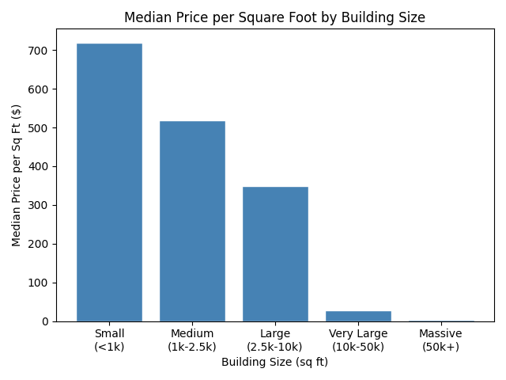
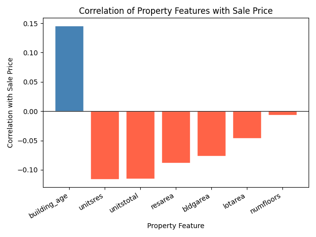

# Data-Science-NYC-Housing-Individual
## Emraan Kafihi | COMP 3125 - Data Science Fundamentals | Wentworth Institute of Technology

## Introduction
This individual report analyzes the NYC Housing Prices dataset from Kaggle. The same dataset used in the group project is analyzed here to answer two additional research questions focused on price per square foot and feature correlation with sale price.

Dataset: https://www.kaggle.com/datasets/ishank2005/nyc-housing-prices-csv

## Selection of Data
The dataset contains 34,439 rows and 19 columns. After dropping missing values and removing rows where building area was zero, the dataset was cleaned for analysis. A new feature `price_per_sqft` was created by dividing sale price by building area. The top 1% of price per square foot values were removed as outliers.

## Methods
- Python for writing code
- Pandas and Numpy for data analysis and manipulation
- Matplotlib for creating visuals
- GitHub for version control

## Results

#### Research Question 1: Does price per square foot vary by building size?
Buildings were grouped into 5 size categories and median price per square foot was calculated for each group using numpy.

Smaller buildings have a significantly higher price per square foot. Small buildings under 1,000 sq ft have a median of $719/sqft while massive buildings over 50,000 sq ft drop to under $3/sqft. This shows smaller properties demand more money per square foot.

#### Research Question 2: What properties are the strongest predictors of sale price?
Calculated the correlation coefficient between each numeric property feature and sale price to identify the strongest linear relationships.

Building age has the strongest positive correlation with sale price (0.15), while residential units and total units have the strongest negative correlations. Overall the correlations are weak individually, suggesting sale price is driven by a combination of factors.

## Discussion
The results show that building size and property features both play a role in determining sale price in NYC. Smaller buildings command higher prices per square foot likely due to their location in prime residential areas. The weak individual correlations in RQ2 suggest that predicting sale price accurately requires multiple features combined, which supports the use of regression models as explored in the group project.

## Summary
- Smaller buildings have a significantly higher price per square foot than larger ones
- Building age is the strongest individual predictor of sale price among the features analyzed
- No single feature strongly predicts sale price on its own
